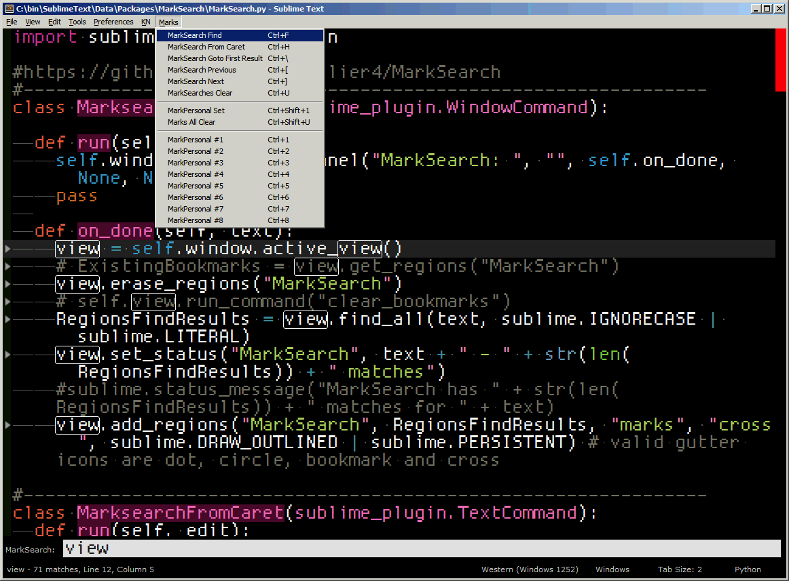

# MarkSearch

For SublimeText ST3.


## MarkSearch

Outlines all search results and then you can iteratively go through them like Prev Result and Next Result while keeping them outlined.

Each search result is kept outlined so you can see them and keep seeing them visually. The SublimeText default interface does not continuously show you all search results highlighted when you are using Prev Result and Next Result and loses the highlight. The visual indication is kept via setting a marker for each search result with the outline mode on. You can then go up and down through each search result with "Ctrl+[" and "Ctrl+]".

* <kbd>ctrl+f</kbd> Do a MarkSearch by typing a search term in the pane (all search results will be outlined)
* <kbd>ctrl+h</kbd> Do a MarkSearch on highlighted cursor text (all search results will be outlined)
* <kbd>ctrl+\\</kbd> Go to the first MarkSearch result
* <kbd>ctrl+]</kbd> Go to the next MarkSearch result (down)
* <kbd>ctrl+[</kbd> Go to the previous MarkSearch result (up)
* <kbd>ctrl+u</kbd> Clear MarkSearch results (and outlines)

The way to use this quickly with a keyboard intuitive workflow is: <kbd>Ctrl+F</kbd> --> <kbd>type in Search Term</kbd> --> <kbd>Ctrl+|</kbd> --> make changes --> <kbd>Ctrl+]</kbd> --> Repeat <kbd>Ctrl+]</kbd>

## MarkPersonal

MarkPersonal Lines are line based marks. You can then jump back to them via Ctrl+number.

This is useful to go back to lines you were previously working on after doing some search based from replacements.

* <kbd>ctrl+shift+1</kbd> Sets a Markpersonal for the current line you are on. This is marked by a circle for the line on the gutter.  
* <kbd>ctrl+1</kbd> Go to Line MarkPersonal 1
* <kbd>ctrl+2</kbd> Go to Line MarkPersonal 2
* <kbd>ctrl+3-9</kbd> Go to Line MarkPersonal 3-9 corresponding to the number key

## Key Bindings Configuration
Since these are replacing your basic find keys this package does not automatically overwrite your existing key bindings. You must choose to add the keybindings yourself for your specific OS.

For Windows, you can use the recommended keybindings by adding the following lines to your *[Sublime_Data_Dir](http://docs.sublimetext.info/en/latest/basic_concepts.html#the-data-directory)\Packages\User\Default (Windows).sublime-keymap* file.
Make sure these keybindings are listed at the end of your keymap file - Later keybindings will override earlier ones listed.
```
{ "keys": ["ctrl+f"], "command": "marksearch_from_pane" },
{ "keys": ["ctrl+h"], "command": "marksearch_from_caret" },

{ "keys": ["ctrl+\\"], "command": "mark_gotobyindex", "args": {"key": "bookmarks", "index": 0} },

{ "keys": ["ctrl+["], "command": "mark_goto_next", "args": {"key": "bookmarks", "forward": false} },
{ "keys": ["ctrl+]"], "command": "mark_goto_next", "args": {"key": "bookmarks", "forward": true} },

{ "keys": ["ctrl+u"], "command": "clear_mark_with_status", "args": {"key": "bookmarks" } },

{ "keys": ["ctrl+shift+u"], "command": "clear_mark_with_status", "args": {"key": "MarkPersonal" } },

{ "keys": ["ctrl+shift+1"], "command": "markpersonal_line" },
{ "keys": ["ctrl+1"], "command": "mark_gotobyindex", "args": {"key": "MarkPersonal", "index": 0} },
{ "keys": ["ctrl+2"], "command": "mark_gotobyindex", "args": {"key": "MarkPersonal", "index": 1} },
{ "keys": ["ctrl+3"], "command": "mark_gotobyindex", "args": {"key": "MarkPersonal", "index": 2} },
{ "keys": ["ctrl+4"], "command": "mark_gotobyindex", "args": {"key": "MarkPersonal", "index": 3} },
{ "keys": ["ctrl+5"], "command": "mark_gotobyindex", "args": {"key": "MarkPersonal", "index": 4} },
{ "keys": ["ctrl+6"], "command": "mark_gotobyindex", "args": {"key": "MarkPersonal", "index": 5} },
{ "keys": ["ctrl+7"], "command": "mark_gotobyindex", "args": {"key": "MarkPersonal", "index": 6} },
{ "keys": ["ctrl+8"], "command": "mark_gotobyindex", "args": {"key": "MarkPersonal", "index": 7} },
{ "keys": ["ctrl+9"], "command": "mark_gotobyindex", "args": {"key": "MarkPersonal", "index": 8} },
{ "keys": ["ctrl+0"], "command": "mark_gotobyindex", "args": {"key": "MarkPersonal", "index": 9} },
```
